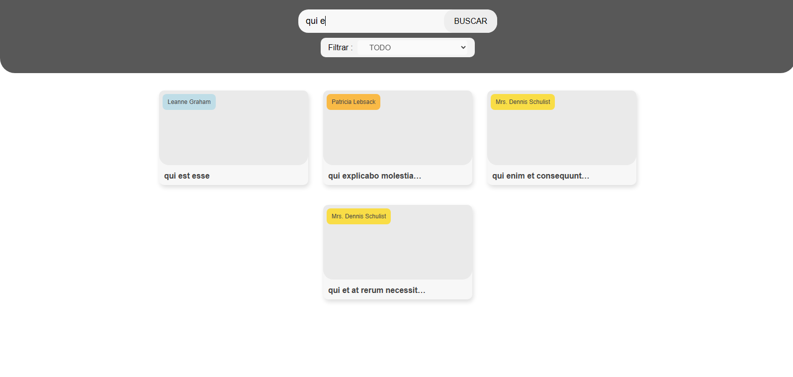

App hecha con **React** y **TypeScript**.

---

## 🛠 Tecnologías utilizadas

- **React + TypeScript**: usado para hacer el proyecto.
- **react-router-dom**: usado para el enrutamiento entre páginas.
- **Context API**: para hacer el contexto y manejar el estado global.
- **CSS Modules**: para dar los estilos y un poco de Tailwind css.

---

## Ejecutar la app Localmente

- clonar el respositorio con git clone : git clone https://github.com/DavidUsnayo/app_react.git
- entrar al proyecto .  
- instalar las dependencias con : npm install  
- ejecutar la app con: npm run dev

